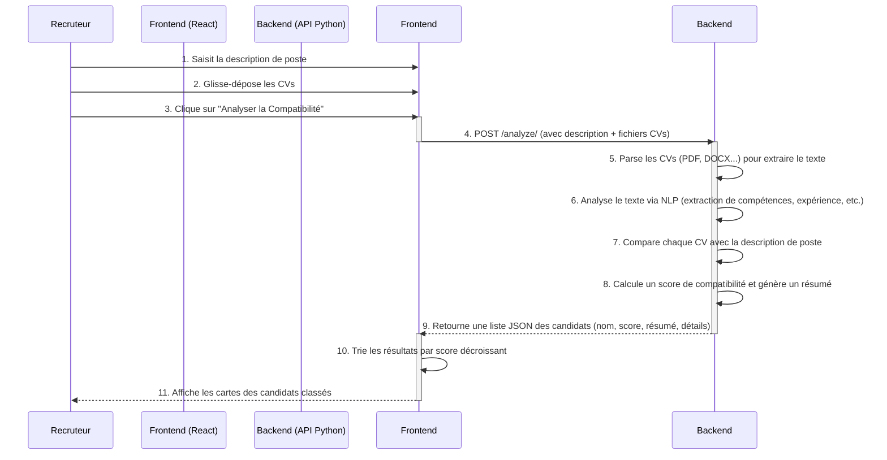

# RH-PRO - Votre Assistant de Recrutement IA

**RH-PRO** est une application web moderne conçue pour révolutionner le processus de recrutement. En s'appuyant sur l'intelligence artificielle, cet outil analyse et compare automatiquement des CVs par rapport à une description de poste, permettant aux recruteurs de gagner un temps précieux et d'identifier rapidement les candidats les plus prometteurs.

## 📖 Table des matières

- [✨ Fonctionnalités clés](#-fonctionnalités-clés)
- [📸 Captures d'écran](#-captures-décran)
- [🛠️ Technologies utilisées](#️-technologies-utilisées)
- [🏛️ Architecture](#️-architecture)
  - [Diagramme de Séquence](#diagramme-de-séquence)
- [🚀 Démarrage rapide](#-démarrage-rapide)
  - [Prérequis](#prérequis)
  - [Installation](#installation)

## ✨ Fonctionnalités clés

-   **Analyse de Description de Poste** : Collez n'importe quelle offre d'emploi pour définir les critères de recherche.
-   **Téléchargement Multiple de CVs** : Importez plusieurs CVs simultanément (.pdf, .docx, .txt) via un simple glisser-déposer.
-   **Scoring de Compatibilité Intelligent** : Chaque candidat reçoit un score de compatibilité basé sur une analyse approfondie de son CV par rapport au poste.
-   **Classement Automatique** : Les résultats sont triés du plus pertinent au moins pertinent, vous présentant les meilleurs profils en premier.
-   **Synthèse par l'IA** : Obtenez un résumé concis généré par l'IA pour chaque candidat, mettant en évidence ses points forts.
-   **Détail des Critères** : Visualisez la performance d'un candidat sur des critères spécifiques (compétences, expérience, etc.).
-   **Interface Intuitive et Moderne** : Un design épuré et une expérience utilisateur fluide pour une prise en main immédiate.

## 📸 Captures d'écran

Voici un aperçu de l'interface de RH-PRO.

### L'interface principale, prête pour l'analyse :

### Cas d'utilisation de la solution :


## 🛠️ Technologies utilisées

### Frontend

-   **[React.js](https://reactjs.org/)** : Bibliothèque JavaScript pour construire des interfaces utilisateur interactives.
-   **[Axios](https://axios-http.com/)** : Client HTTP pour effectuer les requêtes vers le serveur backend.
-   **[React Icons](https://react-icons.github.io/react-icons/)** : Bibliothèque d'icônes (utilisant Feather Icons ici).
-   **CSS Personnalisé** : Styles modernes créés avec Flexbox et CSS Grid pour un design responsive.

### Backend (Architecture supposée)

-   **[Python](https://www.python.org/)** : Langage de prédilection pour les tâches d'IA et de traitement de données.
-   **Framework API (ex: [FastAPI](https://fastapi.tiangolo.com/))** : Pour exposer les endpoints de l'API, notamment `/analyze/`.
-   **Bibliothèques de Traitement de Documents** : Outils comme `PyPDF2`, `python-docx` pour extraire le texte des fichiers.
-   **LLM (Gemini 2.5 flash) : Pour l'analyse de texte, l'extraction d'entités (compétences, expériences) et la comparaison sémantique.

## 🏛️ Architecture

L'application suit une architecture client-serveur classique. Le frontend (React) gère l'interface utilisateur et les interactions, tandis que le backend (Python) prend en charge toute la logique complexe de traitement et d'analyse des documents.

### Diagramme de Séquence

Ce diagramme illustre le flux de données depuis l'interaction du recruteur jusqu'à l'affichage des résultats.

<!-- 
CE DIAGRAMME EST GÉNÉRÉ AVEC MERMAID.
Il sera affiché correctement sur GitHub, GitLab, etc.
Vous pouvez le modifier directement ici.
-->



## 🚀 Démarrage rapide

Suivez ces étapes pour lancer l'application en local.

### Prérequis

-   [Node.js](https://nodejs.org/en/) (version 16 ou supérieure)
-   [npm](https://www.npmjs.com/) ou [yarn](https://yarnpkg.com/)
-   Le serveur backend de RH-PRO doit être cloné, configuré et lancé sur `http://localhost:8000`.
  
### Installation backend

1.  **Clonez le dépôt :**
    ```sh
    git clone https://votre-lien-vers-le-repo.git
    cd backend
    ```
2. **Noublier pas d'ajouter votre api de gemini 2.5 falsh dans le fichier .env**
3. **Lancer le backend**
   ```sh
    uvicorn main:app --reload
    ```

### Installation frontend

1.  **Clonez le dépôt :**
    ```sh
    git clone https://votre-lien-vers-le-repo.git
    cd frontend
    ```

2.  **Installez les dépendances :**
    ```sh
    npm install
    # ou si vous utilisez yarn
    # yarn install
    ```

3.  **Lancez l'application :**
    > **Note :** Assurez-vous que le serveur backend est déjà en cours d'exécution avant de lancer le frontend.
    ```sh
    npm run dev
    # ou
    # yarn start
    ```

4.  Ouvrez votre navigateur et accédez à `http://localhost:3000`.
